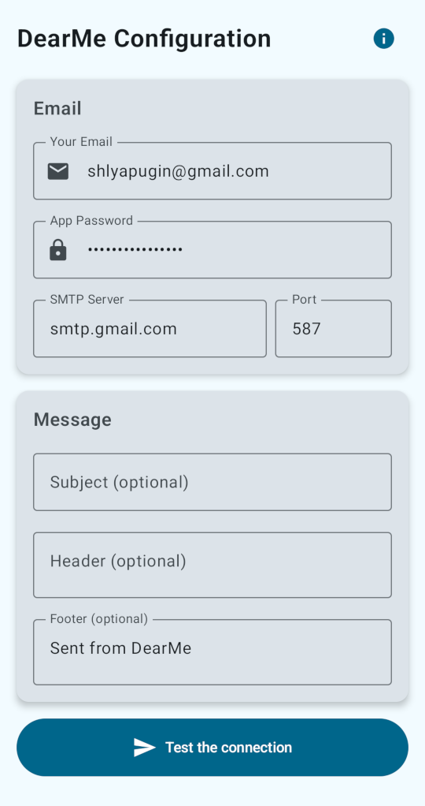

# DearMe — Android Self-Email App

An Android application to send emails to yourself.

## How It Works

Once you set up the app, you can select DearMe from the Share menu at whenever you share text, URLs, or content from any app. DearMe will automatically send you an email with the content you've shared.

## Setup Instructions

### For Gmail Users

1. **Enable 2-Factor Authentication** on your Google account
2. **Generate an App Password**:
   - Go to [Google Account Security](https://myaccount.google.com/security)
   - Navigate to "2-Step Verification" → "App passwords"
   - Generate a new app password for "Mail"
3. **Use the generated app password** in DearMe (not your regular Gmail password)
4. **SMTP Settings** will be automatically configured when you enter your Gmail address

### For Other Providers

1. **Enter your email address** - the app will automatically detect and suggest SMTP settings for main services
2. **Generate an app-specific password** if your provider requires it

## Privacy

- The app doesn't collect or transmit any personal data
- Credentials are stored locally on the device

## License

This project is licensed under the GPL-3.0 License - see the [LICENSE](LICENSE) file for details.
